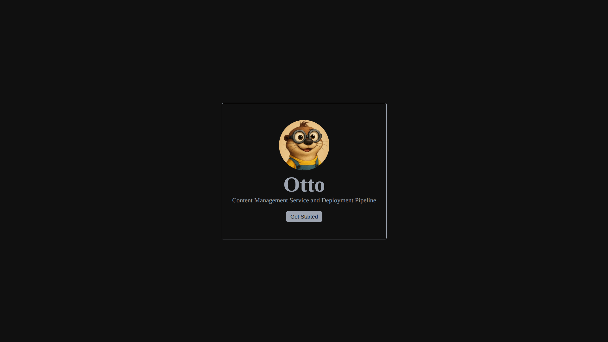

# Otto

Otto is an electron app that serves as the CMS and deployment platform for my blog posts on my personal [site](https://suub.netlify.app/).

Future Plans: I plan to host a web-app as well for the sake of simplicity and learning.

---

## 🗺️ Migration Milestones ("The New World")

This checklist tracks the stages of migrating Otto from index-based CSV tracking to direct Astro content collection parsing.

### 📌 Milestone 1: Shared Tag Config & IPC Utilities Setup
- [x] Create `shared/config/tags.json` to store a unified database of tags.
- [x] Implement `readDirFromGitHub` helper in `gitUtil.js` to fetch directory files list.
- [x] Expose `readDirFromGitHub` via IPC in `preload.js` and `main.js`.
- [x] Update `deployToGitHub` to write directly to `apps/site/src/content/articles/` and omit CSV commits.

### 📌 Milestone 2: Dashboard Migration
- [x] Fetch the file list of `apps/site/src/content/articles/` on load.
- [x] Load and parse frontmatter of all Markdown files asynchronously.
- [x] Update dashboard filtering logic to check tags instead of single CSV categories.
- [x] Remove image elements from items layout.

### 📌 Milestone 3: Article Editor & frontmatter Schema Update
- [x] Delete legacy HTML inputs and preview divs for `thumbnail` and `credits`.
- [x] Replace category dropdown with a comma-separated text input and dynamically loaded tag recommendation pills.
- [x] Update parsing and serialization functions to generate frontmatter matching `@preface/shared` zod schema.

### 📌 Milestone 4: Styles Clean-up
- [x] Remove legacy `.thumbnail` selectors and layout margins from `global.css`.
- [x] Add layout and interactions styles for tag selectors and recommend badge pills.

