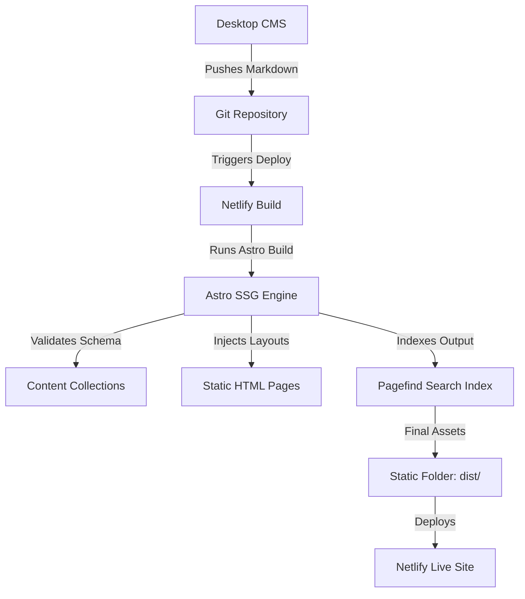

# React to Astro Migration Roadmap

This roadmap outlines the complete architecture and step-by-step strategy to migrate the current React SPA portfolio (located in the `/client` directory) into a modern, 100% static, and high-performance **Astro** website.

---

## 🏗️ Architecture Overview



### Key Differences & Improvements:
1. **Zero Client-Side JavaScript by Default**: Current React app pulls CSV files (`/index/*.csv`) and Markdown files over HTTP, then parses markdown on the client using `marked` and `dompurify`. Astro renders all Markdown to HTML at build time, resulting in instantaneous page loads and zero hydration overhead.
2. **Content Collections (Strict Types)**: Replacing custom CSV lists with Astro Content Collections. Astro will validate the frontmatter schema of all Markdown files (e.g. blog posts, essays) during build, ensuring metadata consistency.
3. **Optimized SEO & Assets**: Astro automatically processes, scales, and lazy-loads local images, generates `sitemap.xml`, and provides an RSS feed out of the box.
4. **Static Search**: Integrating Pagefind to run post-build indexing on the static output files, enabling blazing fast client-side searching without any runtime server.

---

## 📁 Migrated Project Structure

At the end of the migration, the portfolio workspace will follow this clean file hierarchy:

```text
Portfolio/
├── .github/                       # GitHub workflows and settings
├── .gitignore
├── astro.config.mjs               # Astro general configuration
├── netlify.toml                   # Netlify redirect and build instructions
├── package.json                   # Build scripts & dependency declarations
├── package-lock.json
├── tailwind.config.js             # Tailwind CSS tokens & utility rules
├── public/                        # Static assets directory (unprocessed by build)
│   ├── assets/                    # Shared image assets (e.g. border.png, bird.jpg)
│   └── robots.txt
├── src/                           # Main Astro source directory
│   ├── components/                # Modular, reusable Astro components
│   │   ├── Contact.astro          # Contact details & professional link footer
│   │   ├── SEO.astro              # Meta title, tags, JSON-LD structure layout
│   │   ├── Search.astro           # Pagefind client-side search element
│   │   ├── Introduction.astro     # Hero introduction block (CSS animations)
│   │   ├── Contents.astro         # Context description section
│   │   ├── Banner.astro           # Featured content spotlight card
│   │   ├── Index.astro            # Collection link selector cards
│   │   └── Poem.astro             # Poem recitation container
│   ├── content/                   # Content Collections (validated data entries)
│   │   ├── config.ts              # Collection configurations and Schemas
│   │   ├── meditation/            # Meditation posts (Markdown files)
│   │   ├── cerebrum/              # Notes from the Cerebrum
│   │   ├── humanities/            # Humanities posts
│   │   └── becoming/              # Becoming articles
│   ├── layouts/                   # Shared shell layouts
│   │   └── BaseLayout.astro       # Master HTML wrapper layout
│   ├── pages/                     # Routed pages (file-based routing)
│   │   ├── 404.astro              # Custom 404 page
│   │   ├── index.astro            # Primary Landing Page
│   │   ├── rss.xml.js             # Statically built RSS feed endpoint
│   │   ├── [contentType]/
│   │   │   └── index.astro        # Category listings index page
│   │   └── article/
│   │       └── [contentType]/
│   │           └── [slug].astro   # Individual article viewer template
│   ├── styles/                    # Stylesheets
│   │   └── global.css             # Tailwind imports and global typographic rules
│   └── utils/                     # JavaScript/TypeScript helper utilities
│       ├── capitalizeFirst.ts     # String formatting utility
│       ├── convertDate.ts         # Human-readable date converter
│       ├── getCategoryInfo.ts     # Category metadata resolver
│       └── slugifyTitle.ts        # Slug generation helper
```

---

## 🗺️ Step-by-Step Migration Plan

```carousel
# Phase 1: Setup & Environment
1. Initialize a clean Astro workspace.
2. Install dependencies (Tailwind, Sitemap, Pagefind).
3. Configure `astro.config.mjs`.
4. Define the base Tailwind integration.
<!-- slide -->
# Phase 2: Content Collection Schema
1. Set up `src/content/config.ts`.
2. Define schemas for each content type (`meditation`, `cerebrum`, etc.).
3. Move existing Markdown files into `src/content/`.
4. Remove client-side CSV files.
<!-- slide -->
# Phase 3: Layouts & CSS
1. Port global CSS styles from `index.css`.
2. Create a global `BaseLayout.astro`.
3. Build the `<SEO />` component for sitemap, metadata, and Open Graph.
<!-- slide -->
# Phase 4: Route Pages
1. Build `index.astro` (Homepage layout).
2. Build `[contentType]/index.astro` (Category index).
3. Build `[contentType]/[slug].astro` (Individual article pages using `getStaticPaths`).
4. Build `404.astro`.
<!-- slide -->
# Phase 5: Search & Feed Generation
1. Configure `@astrojs/rss` for feeds.
2. Configure `@astrojs/sitemap`.
3. Implement Pagefind search bar using the generated Pagefind index.
<!-- slide -->
# Phase 6: Build & Deployment
1. Set up Netlify deployment commands.
2. Update `netlify.toml` build and publish settings.
3. Validate and run build tests.
```

---

## 🌐 The Holistic Monorepo Integration Strategy

To achieve a perfectly unified theme, a single source of truth for content, and matching rendering between the **Astro Public Site** and the **Otto CMS Desktop Editor**, we will leverage the shared workspace structure.

### 1. Unified Styling & Design Tokens (`shared/`)
We will create a `shared` package to export CSS styles, fonts, and assets:
```text
shared/
├── assets/                        # Shared images (e.g., border.png, bird.jpg)
└── styles/
    └── global.css                 # Master typography, selection colors, and Prism theme rules
```
* **Astro Site (`apps/site`)**: Imports the shared global stylesheet in `src/styles/global.css`:
  ```css
  @import "../../../shared/styles/global.css";
  ```
* **Otto CMS (`apps/cms`)**: Otto's Electron views (`article.html`, `dashboard.html`) link directly to the shared styling, ensuring standard font scaling, borders, and margins look identical.

### 2. Identical Markdown Rendering (Prism & Tailwind Typography)
To guarantee that the preview inside your Electron editor looks *exactly* like the live website:
* **HTML Wrappers**: Both Astro and Otto CMS will wrap parsed HTML inside a standard CSS class:
  ```html
  <article class="article-content prose prose-invert max-w-none">
     <!-- Rendered HTML here -->
  </article>
  ```
* **Syntax Highlighting**:
  - Configure Astro in `astro.config.mjs` to use **Prism** for build-time code syntax rendering.
  - Include `prism.js` in Otto CMS's `article.html` preview.
  - Add your preferred Prism CSS theme (e.g. `prism-tomorrow.css`) to the shared `shared/styles/global.css` file. Since both apps read this style, code fences will look identical.

### 3. Single Source of Truth for Content (Eliminating CSV files)
Currently, Otto CMS maintains a duplicate index of articles inside CSV files (e.g., `/index/meditation.csv`) and pushes them to GitHub alongside the markdown files.
* **In Astro**: We list posts automatically by querying the files in `src/content/` at build time (e.g., `await getCollection('meditation')`). The site has **no need for CSV files**.
* **In Otto CMS (Monorepo benefit!)**:
  - **Local Development**: Since Otto is a desktop app running in the same monorepo, it can scan directories locally using Node's `fs` module to populate its dashboard index (scanning `../../apps/site/src/content/`).
  - **Remote Publishing**: When deploying, Otto only needs to create or update the single Markdown file (`apps/site/src/content/:category/:slug`). The index CSV files are deleted entirely, removing merge conflicts and keeping data management simple.

---

## 📋 Phase 1: Setup & Initialization

1. **Create the Astro Scaffold**:
   Initialize Astro inside the portfolio directory (replacing or archiving the old React client):
   ```bash
   # Create a clean astro project
   npm create astro@latest ./ -- --template minimal --install --git false
   ```

2. **Install Required Integrations**:
   Install Astro integrations for Tailwind CSS (to preserve layout utility styling) and Sitemap:
   ```bash
   npx astro add tailwind
   npx astro add sitemap
   ```

3. **Install Other Dependencies**:
   Install `@astrojs/rss` for RSS feed generation, and `pagefind` for static search indexing:
   ```bash
   npm install @astrojs/rss pagefind
   ```

---

## 🗂️ Phase 2: Content Collections Configuration

Instead of parsing client-side `.csv` indices like `/index/meditation.csv`, Astro handles this at build time using **Content Collections** in `src/content/config.ts`.

### 1. Define the Schema (`src/content/config.ts`)
Create a schema to validate frontmatter and provide type safety for content fields:

```typescript
import { defineCollection, z } from 'astro:content';

const postSchema = z.object({
  title: z.string(),
  description: z.string().optional(),
  date: z.coerce.date(), // Automatically parses YYYY-MM-DD
  updated: z.coerce.date().optional(),
  tags: z.array(z.string()).optional(),
  draft: z.boolean().optional().default(false),
  thumbnail: z.string().optional(),
  credits: z.string().optional(),
  cover: z.string().optional(),
});

export const collections = {
  meditation: defineCollection({ type: 'content', schema: postSchema }),
  cerebrum: defineCollection({ type: 'content', schema: postSchema }),
  humanities: defineCollection({ type: 'content', schema: postSchema }),
  becoming: defineCollection({ type: 'content', schema: postSchema }),
};
```

### 2. File Organization
Move your existing files to follow Astro's content directory structure:
```
src/
└── content/
    ├── meditation/
    │   └── 2025-01-01-my-thoughts.md
    ├── cerebrum/
    │   └── ...
    ├── humanities/
    │   └── ...
    └── becoming/
        └── ...
```

---

## 🎨 Phase 3: Core Layout & Design System

Create a single source of truth for the page frame, global styles, and SEO.

### 1. Global Layout (`src/layouts/BaseLayout.astro`)
This page handles the metadata, Tailwind styling, and standard footer/contact:

```astro
---
import SEO from '../components/SEO.astro';
import Contact from '../components/Contact.astro';
import border from '/assets/border.png';
import '../styles/global.css';

interface Props {
  title: string;
  description?: string;
  image?: string;
  contentType?: string;
}

const { title, description, image, contentType } = Astro.props;
---

<!DOCTYPE html>
<html lang="en">
  <head>
    <meta charset="UTF-8" />
    <meta name="viewport" content="width=device-width, initial-scale=1.0" />
    <SEO title={title} description={description} image={image} />
  </head>
  <body class="bg-[#101010] text-xl text-slate-400 font-serif selection:bg-slate-400 selection:text-[#101010]">
    <main class="w-full px-4 md:px-0 md:w-[50vw] mx-auto py-10">
      <slot />
      
      <Contact />
    </main>
  </body>
</html>
```

### 2. Global Styles (`src/styles/global.css`)
Port your existing `client/src/index.css` code directly here. Use standard Astro Tailwind directives:
```css
@import "tailwindcss"; /* Or @tailwind components / utilities depending on Tailwind version */

hr {
  border: none;
  height: 1px;
  background: #9CA3AF;
  margin: 2rem 0;
  opacity: 0.6;
}

.article-content a {
  text-decoration: underline;
  text-decoration-style: dotted;
  text-decoration-color: #94a3b8;
  text-underline-offset: 8px;
  text-decoration-thickness: 2px;
  transition: color 0.3s ease;
}
```

---

## 🗺️ Phase 4: Route Implementation

Astro pages map directly to HTML output files.

### 1. Homepage (`src/pages/index.astro`)
Contains the introduction text, collection navigation cards, featured banner, and favorite poem.
- **Micro-Animations**: Instead of using heavy Framer Motion scripts, translate them to native CSS animations in the classes, preserving load speeds.
  ```html
  <div class="animate-fade-in-up transition-all duration-700">...</div>
  ```

### 2. Collection Index Pages (`src/pages/[contentType]/index.astro`)
Dynamically fetches the collections at build time, eliminating CSV fetches:

```astro
---
import { getCollection } from 'astro:content';
import BaseLayout from '../../layouts/BaseLayout.astro';
import { getCategoryInfo } from '../../utils/category';

export async function getStaticPaths() {
  const categories = ['meditation', 'cerebrum', 'humanities', 'becoming'];
  return categories.map(category => ({ params: { contentType: category } }));
}

const { contentType } = Astro.params;
const info = getCategoryInfo(contentType);

// Fetch all posts in this collection & sort by date descending
const posts = (await getCollection(contentType))
  .filter(post => !post.data.draft)
  .sort((a, b) => b.data.date.valueOf() - a.data.date.valueOf());
---

<BaseLayout title={info.title} description={info.description}>
  {info.banner && (
    <div class="w-full h-64 md:h-80 overflow-hidden relative rounded-lg grayscale bg-cover bg-center" style={`background-image: url(${info.banner})`}>
      <div class="absolute inset-0 bg-black/40"></div>
    </div>
  )}
  
  <h1 class="text-3xl sm:text-5xl mt-10">{info.title}</h1>
  <p class="my-2">{info.description}</p>
  
  <div class="mt-10">
    {posts.map((post) => (
      <a href={`/article/${contentType}/${post.slug}`} class="block py-8 border-b border-slate-700 hover:bg-[#0F0E0E] transition-all">
        <h3 class="text-slate-400 mb-1 text-2xl font-semibold">{post.data.title}</h3>
        <p class="text-lg text-slate-500 mb-2">{post.data.description}</p>
        <p class="text-sm text-slate-500">{post.data.date.toLocaleDateString()}</p>
      </a>
    ))}
  </div>
</BaseLayout>
```

### 3. Article View Page (`src/pages/article/[contentType]/[slug].astro`)
Renders the Markdown layout directly:

```astro
---
import { getCollection } from 'astro:content';
import BaseLayout from '../../../layouts/BaseLayout.astro';

export async function getStaticPaths() {
  const collectionsList = ['meditation', 'cerebrum', 'humanities', 'becoming'];
  const paths = [];

  for (const collection of collectionsList) {
    const entries = await getCollection(collection);
    for (const entry of entries) {
      paths.push({
        params: { contentType: collection, slug: entry.slug },
        props: { entry },
      });
    }
  }
  return paths;
}

const { entry } = Astro.props;
const { Content } = await entry.render();
---

<BaseLayout title={entry.data.title} description={entry.data.description} image={entry.data.thumbnail}>
  <article class="py-10">
    <h1 class="text-3xl sm:text-5xl mt-10">{entry.data.title}</h1>
    {entry.data.description && <p class="text-lg text-slate-400 mt-4 mb-6 leading-relaxed">{entry.data.description}</p>}
    
    <div class="mb-6 flex items-center space-x-2 text-sm text-slate-500">
      <span>{entry.data.date.toLocaleDateString()}</span>
      <span>|</span>
      <span class="bg-[#9CA3AF] px-2 py-0.5 rounded text-[#101010] bg-opacity-70">{entry.params.contentType}</span>
    </div>

    {entry.data.thumbnail && (
      <div class="my-6">
        
        {entry.data.credits && <p class="text-sm text-slate-500 mt-2 text-center">{entry.data.credits}</p>}
      </div>
    )}

    <div class="article-content mt-8 leading-relaxed prose prose-invert">
      <Content />
    </div>
  </article>
</BaseLayout>
```

---

## 🔍 Phase 5: Client-Side Static Search (Pagefind)

Since Pagefind indexes static HTML files after the project builds:

1. **Build Config Hook**:
   Update `package.json` build scripts to run Pagefind post-build:
   ```json
   "build": "astro build && pagefind --site dist"
   ```

2. **Create Search Component** (`src/components/Search.astro`):
   Load the pagefind scripts dynamically in a lightweight Search component:
   ```astro
   <div id="search"></div>

   <link href="/pagefind/pagefind-ui.css" rel="stylesheet">
   <script is:inline src="/pagefind/pagefind-ui.js"></script>

   <script is:inline>
     window.addEventListener('DOMContentLoaded', (event) => {
       new PagefindUI({ element: "#search", showSubResults: true });
     });
   </script>
   ```

---

## 🚀 Phase 6: Netlify Deployment Configuration

Astro builds directly to a `dist/` directory.

Create or update `/netlify.toml` in the project root:

```toml
[build]
  command = "npm run build"
  publish = "dist"

[[redirects]]
  from = "/*"
  to = "/404.html"
  status = 404
```

---

## 💡 Key Design Recommendations for the Migration

1. **Lightweight Animations**: Replace Framer Motion with standard CSS transitions or standard Tailwind keyframe classes. This removes unnecessary runtime scripts completely.
2. **Typography**: Ensure fonts load efficiently. Use standard system fonts or clean web-safe serif combinations like standard Georgia/Times New Roman with a fallback to avoid FOUT (Flash of Unstyled Text).
3. **Draft Support**: Use Astro collections to filter out draft posts automatically: `.filter(post => !post.data.draft)`, keeping preview posts safe from final deployments.
